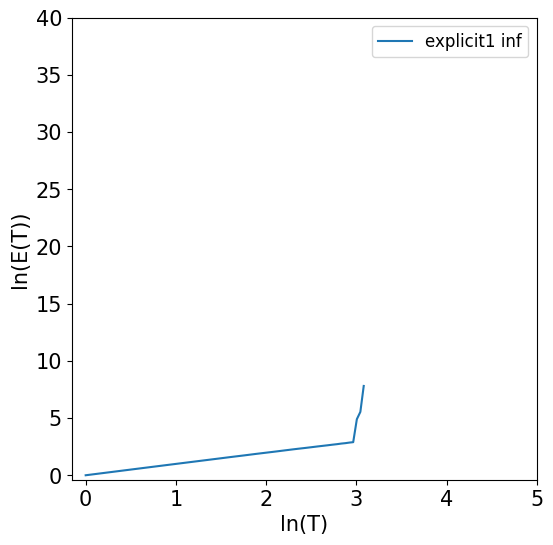
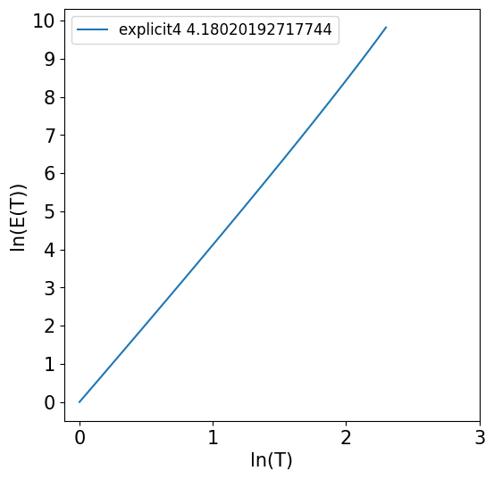
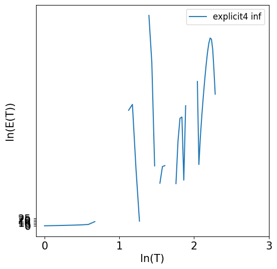
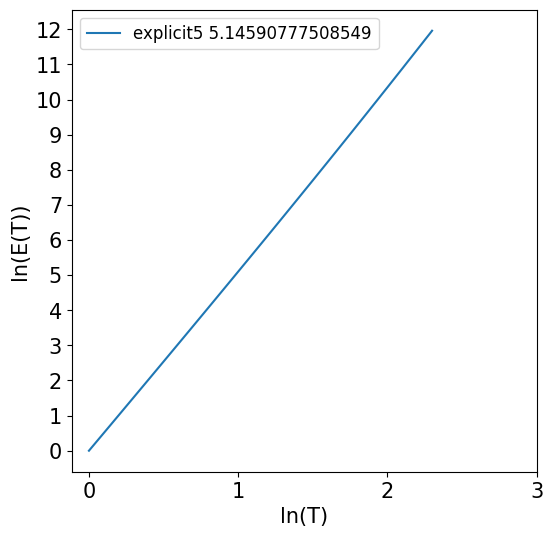
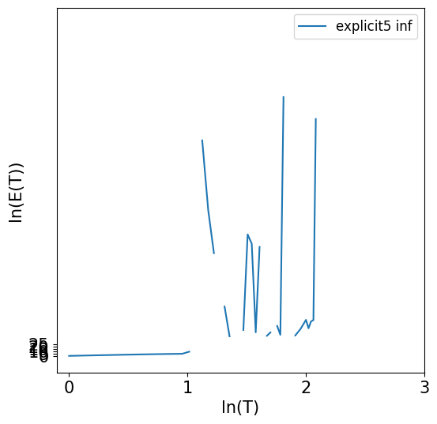
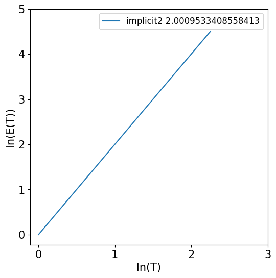

# Численное исследование уравненения Бонгоффера – Ван дер Поля.

## Оглавление

[Постановка задачи](#1)\
[Методы решения](#2)\
[Проверка корректности методов](#3)\
[Применение методов к поставленной задаче, анализ результатов](#4)

<a id="1"></a>

## Постановка задачи

**Дано**:

$$
    \begin{cases}
    x^{\prime} = -a(\frac{x^3}{3} - x) + ay,\\
    y^{\prime} = -x - by + c,\\
    x(0) = 2,\quad y(0) = 0
    \end{cases}
$$

Здесь 1 $\leq$ _a_ $\leq$ $10^3$, 0 < _c_ < 1.

**Задача**:
Провести исследование поведения решений в зависимости от значений «большого» параметра _a_.

<a id="2"></a>

## Методы решения

Для поиска первообразных было выбрано пять численных метода: _явный метод Эйлера_, _явный метод Рунге-Кутты 4го и 5го порядка_, _неявный метод Эйлера 1го порядка_ и _неявный метод Рунге-Кутты 2го порядка (приближение трапецией)_.

### Явный метод Эйлера

Имеем отрезок времени $[T_{0}, T_{\mathrm{fin}}]$. Разобьем его точками $t_{0}, t_{1}, \ldots, t_{\mathrm{n}}$, где $t_{1}=T_{0}$, $t_{n}=T_{\mathrm{fin}}$ и ${\tau} = t_{i} - t_{i-1}$
Для каждой $i$-ой точки найдем ($x_{\mathrm{i}}$, $y_{\mathrm{i}}$) ($0 \leqslant i \leqslant n$). Имеем $\frac{x_{i} - x_{i-1}}{\tau}=x(x_{i-1},
y_{i-1}) \quad \text{и} \quad \frac{y_{i} - y_{i-1}}{\tau}=y(x_{i-1},
y_{i-1}) \quad (1 \leqslant i \leqslant n)$ Получим уравнения:

$$
\mathrm
    x_{i} = \begin{cases} x_{0}&\text{, при $i$ = 0}\\
    x(x_{i-1},y_{i-1})\tau+x_{i-1}&\text{, иначе} \end{cases}
$$

и

$$
\mathrm
    y_{i} = \begin{cases} y_{0}&\text{, при $i$ = 0}\\
    y(x_{i-1},y_{i-1})\tau+y_{i-1}&\text{, иначе} \end{cases}
$$

Применение его к данной задаче:

$$
\mathrm
    x_{i} = \begin{cases} 2 &\text{, при $i$ = 0}\\
    (-a\left(\frac{x_{i-1}^3}{3} - x_{i-1}\right) + ay_{i-1})\tau+x_{i-1}&\text{, иначе} \end{cases}
$$

и

$$
\mathrm
    y_{i} = \begin{cases} 0 &\text{, при $i$ = 0}\\
    (-x_{i-1} - by_{i-1} + c)\tau+y_{i-1}&\text{, иначе} \end{cases}
$$

По этим значениям и будем строить график.

### Неявный метод Эйлера

Неявный метод Эйлера, как и явный, имеет первый порядок, но отличается от последнего тем, что для его применения требуется решить систему уравнений:

$$
    \begin{cases}
    x_{i} = x(x_{i},y_{i})\tau+x_{i-1} \\
    y_{i} = y(x_{i},y_{i})\tau+x_{i-1} \\
    \end{cases}
$$

Применений к нашей задаче:

$$
    \begin{cases}
    x_{i} = (-a(\frac{x_{i}^3}{3} - x_{i}) + ay_{i})\tau+x_{i} \\
    y_{i} = (-x_{i} - by_{i} + c)\tau+y_{i} \\
    \end{cases}
$$

Будем численно искать решение этой системы с помощью _метода Ньютона_. С помощью
него будем искать $x_{i}$. Рассмотрим функцию  
$f(x_{i}) = -x_{i} + (-a\left(\frac{x_{i}^3}{3} - x_{i}\right) + ay_{i})\tau_{i}+x_{i} = 0$.
Суть метода ньютона найти такое $\tilde x_{n}$, такую что $f(\tilde x_{n}) 
\approx 0$, где $\mathrm n$ - число итераций алгоритма, а $\tilde x_{n}$ - точка
приближения. Зададим начальную точку приближения $\tilde x_{0} = x_{i - 1}$.

$$
\tilde x_{i} = \tilde x_{i - 1} -
\frac{f(\tilde x_{i - 1})}{f^{\prime}(\tilde x_{i - 1})} (1 \leqslant i \leqslant n)
$$

Таким образом находим n-ую точку приближения и считаем, что она равна $x_{i}$.
Чем больше итераций будет сделано, тем ближе эта точка будет к настоящему решению, но
делать их слишком много тоже не имеет смысла.  
После того, как мы найдем таким образом $x_{i}$ подставляем ее в уравнение для
$y_{i}$. Так мы получаем точки $(x_{i}, y_{i})$, по ним и строим график.

### Метод Рунге-Кутты 4-го порядка

Метод Рунге-Кутты 4-го порядка - явный одношаговый метод. Точность возрастает за счет дополнительных вычислений на отрезке $[t_n, t_n + T]$.
Если положить $\frac{dy}{dt} = f(t, y)$, где t - независимая переменная, то алгоритм выглядит так:

$$
    \begin{split}
        &k_1 = f(t_n, y_n), \\
        &k_2 = f(t_n + \frac{\tau}{2}, y_n + \frac{\tau}{2}k1), \\
        &k_3 = f(t_n + \frac{\tau}{2}, y_n + \frac{\tau}{2}k2), \\
        &k_4 = f(t_n + \tau, y_n + {\tau}k3) \\
        &\text{тогда следующее значение $y(t)$ считается по формуле:} \\
        &y_{n+1}=y_n + \frac{\tau}{6}(k_1+2k_2+2k_3+k_4)
    \end{split}
$$

В поставленной задаче фактически три переменных, поэтому, если взять $\frac{dx}{dt} = f_x(t, x, y)$ и $\frac{dy}{dt} = f_y(t, x, y)$, метод примет следующий вид:

$$
    \begin{split}
        &k_{y1} = f_y(t_n, y_n, x_n), \\
        &k_{x1} = f_x(t_n, y_n, x_n), \\
        &k_{y2} = f_y(t_n + \frac{\tau}{2}, y_n + \frac{\tau}{2}k_{y1}, x_n + \frac{\tau}{2}k_{x1}), \\
        &k_{x2} = f_x(t_n + \frac{\tau}{2}, y_n + \frac{\tau}{2}k_{y1}, x_n + \frac{\tau}{2}k_{x1}), \\
        &k_{y3} = f_y(t_n + \frac{\tau}{2}, y_n + \frac{\tau}{2}k_{y2}, x_n + \frac{\tau}{2}k_{x2}), \\
        &k_{x3} = f_x(t_n + \frac{\tau}{2}, y_n + \frac{\tau}{2}k_{y2}, x_n + \frac{\tau}{2}k_{x2}), \\
        &k_{y4} = f_y(t_n + T, y_n + {\tau}k_{y3}, x_n + {\tau}k_{x3}), \\
        &k_{x4} = f_x(t_n + T, y_n + {\tau}k_{y3}, x_n + {\tau}k_{x3}), \\
        &\text{соответственно:}\\
        &y_{n+1}=y_n + \frac{\tau}{6}(k_{y1}+2k_{y2}+2k_{y3}+k_{y4}), \\
        &x_{n+1}=x_n + \frac{\tau}{6}(k_{x1}+2k_{x2}+2k_{x3}+k_{x4})
    \end{split}
$$

### Метод Рунге-Кутты-Фельберга 5-го порядка

Методы из семейства Рунге-Кутты могут быть представлены через таблицу Бутчера

$$
    \def\arraystretch{2.2}
    \begin{array}
        {c|cccc}
        c_1 & a_{11} & a_{12} & \ldots & a_{1s} \\
        c_2 & a_{21} & a_{22} & \ldots & a_{2s} \\
        \vdots & \vdots & \vdots & \ddots & \vdots \\
        c_s & a_{s1} & a_{s2} & \ldots & a_{ss} \\
        \hline
        & b_1 & b_2 & \ldots & b_s
    \end{array}
$$

Явные методы имеют общий вид

$$
    \begin{split}
        &k_1 = f(t_n, y_n), \\
        &k_2 = f(t_n + c_2h, y_n + h(a_{21}k_1)), \\
        &k_2 = f(t_n + c_2h, y_n + h(a_{21}k_1)), \\
        &\qquad\qquad\qquad \vdots \\
        &k_i = f(t_n + c_ih, y_n + \tau \sum_{j = 1}^{i - 1}a_{ij}k_j), \\
        &y_{n+1}=y_n + \tau \sum_{i = 1}^{s}b_ik_i
    \end{split}
$$

Так как им соответствует ступенчатая таблица (вот почему суммирование до $i - 1\,$), то есть их применение не требует решения системы уравнений. Поэтому легко реализовать универсальную функцию, которая применяет метод по формулам, используя коэффициенты из таблицы.

Таблиц для метода одного порядка может быть несколько, но они должны удовлетворять некоторым условиям.

Так выглядит одна из таблиц Бутчера для явного метода Рунге-Кутты-Фельберга:

$$
    \def\arraystretch{2.2}
    \begin{array}
        {c|cccccc}
        0 \\
        \frac{1}{4} & \frac{1}{4} \\
        \frac{3}{8} & \frac{3}{32} & \frac{9}{32} \\
        \frac{12}{13} & \frac{1932}{2197} & -\frac{7200}{2197} & \frac{7296}{2197} \\
        1 & \frac{1}{4} & \frac{439}{216} & -8 & \frac{3680}{513} & -\frac{845}{4104} \\
        \frac{1}{2} & -\frac{8}{27} & 2 & -\frac{3544}{2565} & \frac{1859}{4104} & -\frac{11}{40} \\
        \hline
        \quad & \frac{16}{135} & 0 & \frac{6656}{12825} & \frac{28561}{56430} & -\frac{9}{50} & \frac{2}{55}
    \end{array}
$$

### Неявный метод 2-го порядка

Для неявных методов, конечно, тоже существуют таблицы Бутчера. Но так как они не имеют нижнетреугольного вида, общая формула вычисления немного меняется:

$$
    k_i = f(t_n + c_ih, y_n + \tau \sum_{j = 1}^{s}a_{ij}k_j)\qquad \text{(суммирование до $s$)}
$$

В проекте использовался _метод Кранка-Николсона_ --- правило трапеции, только в неявной форме. Таблица Бутчера для него следующая

$$
    \def\arraystretch{2.2}
    \begin{array}
        {c|ccc}
        0 & 0 & 0 \\
        1 & \frac{1}{2} & \frac{1}{2} \\
        \hline
        & \frac{1}{2} & \frac{1}{2}
    \end{array}
$$

$$
    \begin{split}
        &\mkern15mu k_{y1} = f_y(t_n, y_n, x_n), \\
        &\mkern15mu k_{x1} = f_x(t_n, y_n, x_n), \\
        &\text{Теперь требуется решить систему уравнений для двух неизвестных: $k_{x2}$, $k_{y2}$} \\
        &\begin{cases}
            k_{y2} = f_y(t_n + \frac{\tau}{2}, y_n + \frac{\tau}{2}k_{y1} + \frac{\tau}{2}k_{y2}, x_n + \frac{\tau}{2}k_{x1} + \frac{\tau}{2}k_{x2}), \\
            k_{x2} = f_x(t_n + \frac{\tau}{2}, y_n + \frac{\tau}{2}k_{y1} + \frac{\tau}{2}k_{y2}, x_n + \frac{\tau}{2}k_{x1} + \frac{\tau}{2}k_{x2})
        \end{cases}
    \end{split}
$$

Система уравнений в проекте решается с помощью модуля `SciPy` языка `Python`, конкретно, функцией `scipy.optimize.root(fun, x0, jac, method)`. Эта функция решает уравнение с помощью численных методов, принимая на вход

<ol>
  <li>```fun``` --- функции, которые обращаются в ноль при подстановке корней</li>
  <li>```x0``` --- предпологаемое решение, от которого отталкивается метод</li>
  <li>```jac``` --- матрица Якоби для функций из fun</li>
  <li>```method``` --- метод, которым будет решаться уравнение, был выбран ```hybr```</li>
</ol>

После получения корней, т.е. $k_{x2}, k_{y2}$, остается подставить их в выражения

$$
y_{n+1}=y_n + \tau \sum_{i = 1}^{s}b_ik_i = y_n + \frac{\tau}{2}(k_{y1}+k_{y2}), \\
x_{n+1}=x_n + \tau \sum_{i = 1}^{s}b_ik_i = x_n + \frac{\tau}{2}(k_{x1}+k_{x2})
$$

### Адаптивный шаг

В задачах такого типа зачастую шаг делают не фискированным, а адаптивным,
то есть меняющимся во время работы алгоритма. Делается это от того, что жесткие
задачи содержат участки быстрого изменения решения, поэтому при взятия большого
шага будет значительно терятся точность. Если же брать постоянный маленький шаг
алгоритм будет работать слишком долго. Мы также решили реализовать адапативный шаг.

Мы имеешь систему ОДУ, вида

$$
\frac{f_{i}}{dt} = f_{i}(\mathbf{u}, t) \qquad (1 \leqslant i \leqslant 2)
$$

Возьмем новый аргумент - длину дуги интегральной кривой:

$$
    \begin{split}
        &dl = \rho dt, \rho = \left(1 + \sum f_{i}^{2} \right)^{1/2}, \\
        &\text{тогда}\\
        &\frac{f_{i}}{dl} = F_{i}(\mathbf{u}), F_{i}=f_{i}\rho^{-1} (1 \leqslant i \leqslant 2)
    \end{split}
$$

Будем выбирать шаг в зависимости от кривизны интегральной кривой, по формуле:

$$
\tau = \frac{\tau_0}{(1 + L^{0.5/\nu}(\chi, \chi)^{0.25/\nu})^{\nu}}
$$

Здесь L - полный промежуток интегрирования оп l, $\chi$ - кривизна, T_0 - шаг на
почти прямом участке интегральной кривой. Численные расчеты показали,
что для сверхжестких задач целесообразно выбирать $\nu = 2$, а для задач
меньшей жесткости – $\nu = 1$. Мы взяли $\nu = 1$.
Таким образом мы строим сетку, начиная с $T_0$. Делается это одновременно с
вычислением решения, поэтому она будеи под него адапитирована.
$\chi = T*{prev}(\mathbf{F - F*{prev})}$, где $T*{prev}$ - предыдущий шаг.
Алгоритмы от применения адаптивного шага не меняются, меняется только сетка
точек, по которым мы строим график.

<a id="3"></a>

## Проверка корректности методов

### 1ая тестовая задача (не жесткая)

Для задачи

$$
    \begin{cases}
        x^{\prime} = 5x + 3y, \\
        y^{\prime} = -3x - y
    \end{cases}
$$

Численные методы показывают следующую погрешность

#### Явный метод Эйлера 1-го порядка

#### Неявный метод Эйлера 1-го порядка

#### Метод Рунге-Кутты 4-го порядка

#### Метод Рунге-Кутты-Фельберга 5-го порядка

#### Метод Кранка-Николсона 2-го порядка

### 2ая тестовая задача (жесткая)

Наша вторая тестовая задача является жесткой. Общепринятого математического определения
жестких ОДУ нет, однако у них есть важное свойство, явные методы являются крайне не
устойчивыми при решении ими таких задач.
Вот сама система:

$$
\begin{split}
& x^{\prime} = \lambda \left [\cos^{2}(t)\sin (t) + 2\cos (t) - (2 + xy)x \right ]-y \\
& y^{\prime} = x + y - \sin (t)
\end{split}
$$

Ее жесткость определяется фиксированным параметром $\lambda$. Эта задача имеет
точное решение в замкнутой форме:
$$\begin{split} & x = \cos (t) \\& y = \sin (t) \end{split}$$
Для жесткой задачи оказалось, что явные методы крайне неустойчивы и все имеют погрешность = 1
И чем больше показатель жесткости, тем хуже ситуация

#### Явный метод Эйлера 1-го порядка

При $\lambda = 10$ наклон равен $0.963$: $\quad \quad$ При $\lambda = 100$ наклон равен $\infty$:

{ width=200px } { width=200px }

#### Метод Рунге-Кутты 4-го порядка

При $\lambda = 10$ наклон равен $0.977$: $\quad \quad$ При $\lambda = 100$ наклон равен $0.999$:

{ width=200px } { width=200px }

#### Метод Рунге-Кутты-Фельберга 5-го порядка

При $\lambda = 10$ наклон равен $0.977$: 

{ width=200px }

При $\lambda = 10$ наклон равен $0.977$: $\quad \quad$ При $\lambda = 100$ наклон равен $\infty$:

{ width=200px } { width=200px }

#### Неявный метод Эйлера 1-го порядка
При $\lambda = 10000$:

{ width=200px }

#### Метод Кранка-Николсона 2-го порядка
При $\lambda = 10000$:

{ width=200px }

#### Вывод 
Анализ нашей задачи лучше будет производить с помощью неявного метода, так как он устойчив,
даже при высокой степени жесткости задачи. Хоть метод Рунге-Кутты-Фельберга 5-го порядка
также нестойчив, как и метод Метод Рунге-Кутты 4-го порядка, его запас устойчивости больше.

<a id="4"></a>

## Применение методов к поставленной задаче, анализ результатов

Сравним график x от t полученный методами явного 5го порядка и неявного 1го - получим одно и то же, как для прошлой задачи
В качестве проверки приведем графики модуля SciPy

В связи со сказанным выше исследования проведем с помощью неявного метода Эйлера

$$
$$
